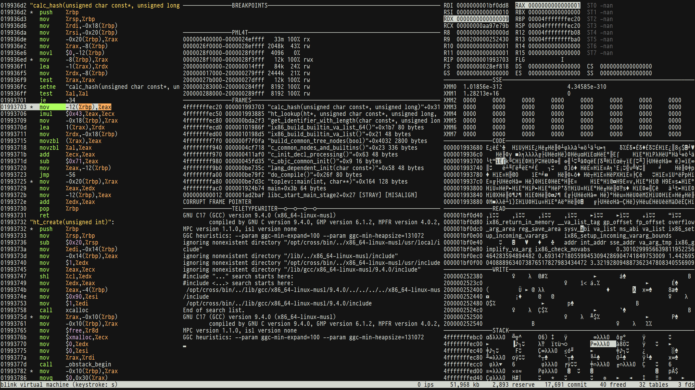

[](https://github.com/jart/blink/actions/workflows/build.yml)
[](https://github.com/jart/blink/actions/workflows/cygwin.yml)
[](https://github.com/jart/blink/actions/workflows/emscripten.yml)
# Blinkenlights

This project contains two programs:

`blink` is a virtual machine that runs x86-64-linux programs on
different operating systems and hardware architectures. It's designed to
do the same thing as the `qemu-x86_64` command, except that

1. blink is 180kb in size, whereas the qemu-x86_64 executable is 4mb

2. blink will run your Linux binaries on any POSIX platform, whereas
   qemu-x86_64 only supports Linux

3. blink goes 2x faster than qemu-x86_64 on some benchmarks, such as SSE
   integer / floating point math. Blink is also faster at running
   ephemeral programs such as compilers

[`blinkenlights`](https://justine.lol/blinkenlights) is a TUI interface
that may be used for debugging x86_64-linux programs across platforms.
Unlike GDB, Blinkenlights focuses on visualizing program execution. It
uses UNICODE IBM Code Page 437 characters to display binary memory
panels, which change as you step through your program's assembly code.
These memory panels may be scrolled and zoomed using your mouse wheel.
Blinkenlights also permits reverse debugging, where scroll wheeling over
the assembly display allows the rewinding of execution history.

## Getting Started

We regularly test that Blink is able run x86-64-linux binaries on the
following platforms:

- Linux (x86, ARM, RISC-V, MIPS, PowerPC, s390x)
- MacOS (x86, ARM)
- FreeBSD
- OpenBSD
- NetBSD
- Cygwin (no JIT on Windows yet)

Blink depends on the following libraries:

- libc (POSIX.1-2017)

Blink can be compiled on UNIX systems that have:

- A C11 compiler (e.g. GCC 4.9.4+)
- Modern GNU Make (i.e. not the one that comes with XCode)

The instructions for compiling Blink are as follows:

```sh
$ make -j4
$ o//blink/blink -h
Usage: o//blink/blink [-hjms] PROG [ARGS...]
```

Here's how you can run a simple hello world program with Blink:

```sh
o//blink/blink third_party/cosmo/tinyhello.elf
```

Blink has a debugger TUI, which works with UTF-8 ANSI terminals. The
most important keystrokes in this interface are `?` for help, `s` for
step, `c` for continue, and scroll wheel for reverse debugging.

```sh
o//blink/blinkenlights third_party/cosmo/tinyhello.elf
```

### Testing

Blink is tested primarily using precompiled x86 binaries, which are
downloaded automatically. You can check how well Blink works on your
local platform by running:

```sh
make check
```

To check that Blink works on 11 different hardware `$(ARCHITECTURES)`
(see [Makefile](Makefile)), you can run the following command, which
will download statically-compiled builds of GCC and Qemu. Since our
toolchain binaries are intended for x86-64 Linux, Blink will bootstrap
itself locally first, so that it's possible to run these tests on other
operating systems and architectures.

```sh
make check2
make emulates
```

### Alternative Builds

For maximum performance, use `MODE=rel` or `MODE=opt`. Please note the
release mode builds will remove all the logging and assertion statements
and Blink isn't mature enough for that yet. So extra caution is advised.

```sh
make MODE=rel
o/rel/blink/blink -h
```

For maximum tinyness, use `MODE=tiny`. This build mode will not only
remove logging and assertion statements, but also reduce performance in
favor of smaller binary size whenever possible.

```sh
make MODE=tiny
strip o/tiny/blink/blink
ls -hal o/tiny/blink/blink
```

You can hunt down bugs in Blink using the following build modes:

- `MODE=asan` helps find memory safety bugs
- `MODE=tsan` helps find threading related bugs
- `MODE=ubsan` to find violations of the C standard
- `MODE=msan` helps find uninitialized memory errors

## Reference

### `blink` Flags

Your Blink VM may be started with the following command line flags:

- `-h` shows this help

- `-j` disables Just-In-Time (JIT) compilation, which will make Blink go
  ~10x slower.

- `-m` disables the linear memory optimization. This makes Blink memory
  safe, but comes at the cost of going ~4x slower. On some platforms
  this can help avoid the possibility of an mmap() crisis. This option
  is required, if Blink is running inside Blink, in which case only one
  level of simulation may use the linear memory optimization.

- `-L PATH` specifies the log path. The default log path is
  `$TMPDIR/blink.log` or `/tmp/blink.log` if `$TMPDIR` isn't defined. If
  a log file isn't desired, this flag may be set to `-` or `/dev/stderr`
  for logging to standard error.

- `-s` will cause internal statistics to be printed to standard error on
  exit. Stats aren't available in `MODE=rel` and `MODE=tiny` builds, and
  this flag is ignored.

### `blinkenlights` Flags

Blinkenlights' TUI may be started with the following command line flags:

- `-h` shows this help

- `-r` puts your virtual machine real mode. This may be used to run
  16-bit i8086 programs, such as SectorLISP. It's also used for booting
  programs from Blinkenlights's simulated BIOS.

- `-b ADDR` pushes a breakpoint, which may be specified as a raw
  hexadecimal address, or a symbolic name that's defined by your ELF
  binary (or its associated `.dbg` file). When pressing `c` (continue)
  or `C` (continue harder) in the TUI, Blink will immediately stop upon
  reaching an instruction that's listed as a breakpoint, after which a
  modal dialog is displayed. The modal dialog may be cleared by `ENTER`
  after which the TUI resumes its normal state.

- `-w ADDR` pushes a watchpoint, which may be specified as a raw
  hexadecimal address, or a symbolic name that's defined by your ELF
  binary (or its associated `.dbg` file). When pressing `c` (continue)
  or `C` (continue harder) in the TUI, Blink will immediately stop upon
  reaching an instruction that either (a) has a ModR/M encoding that
  references an address that's listed as a watchpoint, or (b) manages to
  mutate the memory stored at a watchpoint address by some other means.
  When Blinkenlights is stopped at a watchpoint, a modal dialog will be
  displayed which may be cleared by pressing `ENTER`, after which the
  TUI resumes its normal state.

- `-j` enables Just-In-Time (JIT) compilation. This will make
  Blinkenlights go significantly faster, at the cost of taking away the
  ability to step through each instruction. The TUI will visualize JIT
  path formation in the assembly display; see the JIT Path Glyphs
  section below to learn more. Please note this flag has the opposite
  meaning as it does in the `blink` command.

- `-m` enables the linear memory optimization. This makes blinkenlights
  capable of faster emulation, at the cost of losing some statistics. It
  no longer becomes possible to display which percentage of a memory map
  has been activated. Blinkenlights will also remove the commit /
  reserve / free page statistics from the status panel on the bottom
  right of the display. Please note this flag has the opposite meaning
  as it does in the `blink` command.

- `-t` may be used to disable Blinkenlights TUI mode. This makes the
  program behave similarly to the `blink` command, however not as good.
  We're currently using this flag for unit testing real mode programs,
  which are encouraged to use the `SYSCALL` instruction to report their
  exit status.

- `-L PATH` specifies the log path. The default log path is
  `$TMPDIR/blink.log` or `/tmp/blink.log` if `$TMPDIR` isn't defined.

- `-s` will cause internal statistics to be printed to standard error on
  exit. Stats aren't available in `MODE=rel` and `MODE=tiny` builds, and
  this flag is ignored.

- `-H` disables syntax highlighting

- `-R` disables reactive error mode

- `-v` increases verbosity

#### JIT Path Glyphs

When the Blinkenlights TUI is run with JITing enabled (using the `-j`
flag) the assembly dump display will display a glyph next to the address
of each instruction, to indicate the status of JIT path formation. Those
glyphs are defined as follows:

- ` ` or space indicates no JIT path is associated with an address

- `S` means that a JIT path is currently being constructed which
  starts at this address. By continuing to press `s` (step) in the TUI
  interface, the JIT path will grow longer until it is eventually
  completed, and the `S` glyph is replaced by `*`.

- `*` (asterisk) means that a JIT path has been installed to the
  adjacent address. When `s` (step) is pressed at such addresses
  within the TUI display, stepping takes on a different meaning.
  Rather than stepping a single instruction, it will step the entire
  length of the JIT path. The next assembly line that'll be
  highlighted will be the instruction after where the path ends.

- `G` means that a hook has been explicitly set to `GeneralDispatch`.
  This setting currently isn't used.

### Environment Variables

- `BLINK_LOG_FILENAME` may be specified to supply a log path to be used
  in cases where the `-L PATH` flag isn't specified. This value should
  be an absolute path. It may be `/dev/stderr` to avoid needing a file.

## Compiling and Running Programs under Blink

Blink can be picky about which Linux binaries it'll execute. It may also
be the case that your Linux binary will only run under Blink on Linux,
but report errors if run under Blink on another platform, e.g. MacOS. In
our experience, how successfully a program can run under Blink depends
almost entirely on (1) how it was compiled, and (2) which C library it
uses. This section will provide guidance on which tools will work best.

First, some background. Blink's coverage of the x86_64 instruction set
is comprehensive. However the Linux system call ABI is much larger and
therefore not possible to fully support, unless Blink emulated a Linux
kernel image too. Blink has sought to support the subset of Linux ABIs
that are either (1) standardized by POSIX.1-2007 or (2) too popular to
*not* support. As an example, `AF_INET`, `AF_UNIX`, and `AF_INET6` are
supported, but Blink will return `EINVAL` if a program requests any of
the dozens of other ones, e.g. `AF_BLUETOOTH`. Such errors are usually
logged to `/tmp/blink.log`, to make it easy to file a feature request.
In other cases ABIs aren't supported simply because they're Linux-only
and difficult to polyfill on other POSIX platforms. For example, Blink
will polyfill `open(O_TMPFILE)` on non-Linux platforms so it works the
same way, but other Linux-specific ABIs like `membarrier()` we haven't
had the time to figure out yet. Since app developers usually don't use
non-portable APIs, it's usually the platform C library that's at fault
for calling them. Many Linux system calls, could be rightfully thought
of as an implementation detail of Glibc.

Blink's prime directive is to support binaries built with Cosmopolitan
Libc. Actually Portable Executables make up the bulk of Blink's unit
test suite. Anything created by Cosmopolitan is almost certainly going
to work very well. Since Cosmopolitan is closely related to Musl Libc,
programs compiled using Musl also tend to work very well. For example,
Alpine Linux is a Musl Libc based distro, so their prebuilt dynamic
binaries tend to all work well, and it's also a great platform to use
for compiling other software from source that's intended for Blink.

So the recommended approach is either:

1. Build your app using Cosmopolitan Libc, otherwise
2. Build your app using GNU Autotools on Alpine Linux

For Cosmopolitan, please read [Getting Started with Cosmopolitan
Libc](https://jeskin.net/blog/getting-started-with-cosmopolitan-libc/)
for information on how to get started. Cosmopolitan comes with a lot of
third party software included that you can try with Blink right away,
e.g. SQLite, Python, QuickJS, and Antirez's Kilo editor.

```
git clone https://github.com/jart/cosmopolitan/
cd cosmopolitan

make -j8 o//third_party/python/python.com
blinkenlights -jm o//third_party/python/python.com

make -j8 o//third_party/quickjs/qjs.com
blinkenlights -jm o//third_party/quickjs/qjs.com

make -j8 o//third_party/sqlite3/sqlite3.com
blinkenlights -jm o//third_party/sqlite3/sqlite3.com

make -j8 o//examples/kilo.com
blinkenlights -jm o//examples/kilo.com
```

But let's say you want to build an Autotools project like Emacs. The
best way to do that is to spin up an Alpine Linux container and use
[jart/blink-isystem](https://github.com/jart/blink-isystem) as your
system header subset. blink-isystem is basically just the Musl Linux
headers with all the problematic APIs commented out. That way autoconf
won't think the APIs Blink doesn't have are available, and will instead
configure Emacs to use portable alternatives. Setting this up is simple:

```
./configure CFLAGS="-isystem $HOME/blink-isystem" \
            CXXFLAGS="-isystem $HOME/blink-isystem" \
            LDFLAGS="-static -Wl,-z,common-page-size=65536,-z,max-page-size=65536"
make -j
```

Another big issue is the host system page size may cause problems on
non-Linux platforms like Apple M1 (16kb) and Cygwin (64kb). On such
platforms, you may encounter an error like this:

```
p_vaddr p_offset skew unequal w.r.t. host page size
```

The simplest way to solve that is by disabling the linear memory
optimization (using the `blink -m` flag) but that'll slow down
performance. Another option is to try recompiling your executable so
that its ELF program headers will work on systems with a larger page
size. You can do that using these GCC flags:

```
gcc -static -Wl,-z,common-page-size=65536,-z,max-page-size=65536 ...
```

However that's just step one. The program also needs to be using APIs
like `sysconf(_SC_PAGESIZE)` which will return the true host page size,
rather than naively assuming it's 4096 bytes. Your C library gets this
information from Blink via `getauxval(AT_PAGESZ)`.

If you're using the Blinkenlights debugger TUI, then another important
set of flags to use are the following:

- `-fno-omit-frame-pointer`
- `-mno-omit-leaf-frame-pointer`

By default, GCC and Clang use the `%rbp` backtrace pointer as a general
purpose register, and as such, Blinkenlights won't be able to display a
frames panel visualizing your call stack. Using those flags solves that.
However it's tricky sometimes to correctly specify them in a complex
build environment, where other optimization flags might subsequently
turn them back off again.

The trick we recommend using for compiling your programs, is to create a
shell script that wraps your compiler command, and then use the script
in your `$CC` environment variable. The script should look something
like the following:

```sh
#!/bin/sh
exec cc \
  -g \
  -Os \
  -no-pie \
  -fno-pie \
  -static \
  "$@" \
  -U_FORTIFY_SOURCE \
  -fno-stack-protector \
  -fno-omit-frame-pointer \
  -mno-omit-leaf-frame-pointer \
  -Wl,-z,common-page-size=65536 \
  -Wl,-z,max-page-size=65536
```

Those flags will go a long way towards helping your Linux binaries be
(1) capable of running under Blink on all of its supported operating
systems and microprocessor architectures, and (2) trading away some of
the modern security blankets in the interest of making the assembly
panel more readable, and less likely to be picky about memory.

If you're a Cosmopolitan Libc user, then Cosmopolitan already provides
such a script, which is the `cosmocc` and `cosmoc++` toolchain. Please
note that Cosmopolitan Libc uses a 64kb page size so it isn't impacted
by many of these issues that Glibc and Musl users may experience.

- [cosmopolitan/tool/scripts/cosmocc](https://github.com/jart/cosmopolitan/blob/master/tool/scripts/cosmocc)
- [cosmopolitan/tool/scripts/cosmoc++](https://github.com/jart/cosmopolitan/blob/master/tool/scripts/cosmoc%2B%2B)

If you're not a C / C++ developer, and you prefer to use high-level
languages instead, then one program you might consider emulating is
Actually Portable Python, which is an APE build of the CPython v3.6
interpreter. It can be built from source, and then used as follows:

```
git clone https://github.com/jart/cosmopolitan/
cd cosmopolitan
make -j8 o//third_party/python/python.com
blinkenlights -jm o//third_party/python/python.com
```

The `-jm` flags are helpful here, since they ask the Blinkenlights TUI
to enable JIT and the linear memory optimization. It's helpful to have
those flags because Python is a very complicated and compute intensive
program, that would otherwise move too slowly under the Blinkenlights
vizualization. You may also want to press the `CTRL-T` (TURBO) key a few
times, to make Python emulate in the TUI even faster.

## Technical Details

blink is an x86-64 interpreter for POSIX platforms that's written in
ANSI C11 that's compatible with C++ compilers. Instruction decoding is
done using our trimmed-down version of Intel's disassembler Xed.

The prime directive of this project is to act as a virtual machine for
userspace binaries compiled by Cosmopolitan Libc. However we've also had
success virtualizing programs compiled with Glibc and Musl Libc, such as
GCC and Qemu. Blink supports 500+ instructions and 150+ Linux syscalls,
including fork() and clone(). Linux system calls may only be used by
long mode programs via the `SYSCALL` instruction, as it is written in
the System V ABI.

### Instruction Sets

The following hardware ISAs are supported by Blink.

- i8086
- i386
- X87
- SSE2
- x86_64
- SSE3
- SSSE3
- CLMUL
- POPCNT
- ADX
- BMI2
- RDRND
- RDSEED
- RDTSCP

Programs may use `CPUID` to confirm the presence or absence of optional
instruction sets. Please note that Blink does not follow the same
monotonic progress as Intel's hardware. For example, BMI2 is supported;
this is an AVX2-encoded (VEX) instruction set, which Blink is able to
decode, even though the AVX2 ISA isn't supported. Therefore it's
important to not glob ISAs into "levels" (as Windows software tends to
do) where it's assumed that BMI2 support implies AVX2 support; because
with Blink that currently isn't the case.

On the other hand, Blink does share Windows' x87 behavior w.r.t. double
(rather than long double) precision. It's not possible to use 80-bit
floating point precision with Blink, because Blink simply passes along
floating point operations to the host architecture, and very few
architectures support `long double` precision. You can still use x87
with 80-bit words. Blink will just store 64-bit floating point values
inside them, and that's a legal configuration according to the x87 FPU
control word. If possible, it's recommended that `long double` simply be
avoided. If 64-bit floating point [is good enough for the rocket
scientists at
NASA](https://www.jpl.nasa.gov/edu/news/2016/3/16/how-many-decimals-of-pi-do-we-really-need/)
then it should be good enough for everybody. There are some peculiar
differences in behavior with `double` across architectures (which Blink
currently does nothing to address) but they tend to be comparatively
minor, e.g. an op returning `NAN` instead of `-NAN`.

Blink has reasonably comprehensive coverage of the baseline ISAs,
including even support for BCD operations (even in long mode!) But there
are some truly fringe instructions Blink hasn't implemented, such as
`BOUND` and `ENTER`. Most of the unsupported instructions, are usually
ring-0 system instructions, since Blink is primarily a user-mode VM, and
therefore only has limited support for bare metal operating system
software (which we'll discuss more in-depth in a later section).

Blink advertises itself as `blink 4.0` in the `uname()` system call.
Programs may detect they're running in Blink by issuing a `CPUID`
instruction where `EAX` is set to the leaf number:

- Leaf `0x0` (or `0x80000000`) reports `GenuineIntel` in
  `EBX ‖ EDX ‖ ECX`

- Leaf `0x1` reports that Blink is a hypervisor in bit `31` of `ECX`

- Leaf `0x40000000` reports `GenuineBlink` as the hypervisor name in
  `EBX ‖ ECX ‖ EDX`

- Leaf `0x40031337` reports the underlying operating system name in
  `EBX ‖ ECX ‖ EDX` with zero filling for strings shorter than 12:

  - `Linux` for Linux
  - `XNU` for MacOS
  - `FreeBSD` for FreeBSD
  - `NetBSD` for NetBSD
  - `OpenBSD` for OpenBSD
  - `Linux` for Linux
  - `Cygwin` for Windows under Cygwin
  - `Windows` for Windows under Cosmopolitan
  - `Unknown` if compiled on unrecognized platform

- Leaf `0x80000001` tells if Blink's JIT is enabled in bit `31` in `ECX`

### JIT

Blink uses just-in-time compilation, which is supported on x86_64 and
aarch64. Blink takes the appropriate steps to work around restrictions
relating to JIT, on platforms like Apple and OpenBSD. We generate JIT
code using a printf-style domain-specific language. The JIT works by
generating functions at runtime which call the micro-op functions the
compiler created. To make micro-operations go faster, Blink determines
the byte length of the compiled function at runtime by scanning for a
RET instruction. Blink will then copy the compiled function into the
function that the JIT is generating. This works in most cases, however
some tools can cause problems. For example, OpenBSD RetGuard inserts
static memory relocations into every compiled function, which Blink's
JIT currently doesn't understand; so we need to use compiler flags to
disable that type of magic. In the event other such magic slips through,
Blink has a runtime check which will catch obvious problems, and then
gracefully fall back to using a CALL instruction. Since no JIT can be
fully perfect on all platforms, the `o//blink/blink -j` flag may be
passed to disable Blink's JIT. Please note that disabling JIT makes
Blink go 10x slower. With the `o//blink/blinkenlights` command, the `-j`
flag takes on the opposite meaning, where it instead *enables* JIT. This
can be useful for troubleshooting the JIT, because the TUI display has a
feature that lets JIT path formation be visualized. Blink currently only
enables the JIT for programs running in long mode (64-bit) but we may
support JITing 16-bit programs in the future.

### Virtualization

Blink virtualizes memory using the same PML4T approach as the hardware
itself, where memory lookups are indirected through a four-level radix
tree. Since performing four separate page table lookups on every memory
access can be slow, Blink checks a translation lookaside buffer, which
contains the sixteen most recently used page table entries. The PML4T
allows all memory lookups in Blink to be "safe" but it still doesn't
offer the best possible performance. Therefore, on systems with a huge
address space (i.e. petabytes of virtual memory) Blink relies on itself
being loaded to a random location, and then identity maps guest memory
using a simple linear translation. For example, if the guest virtual
address is `0x400000` then the host address might be
`0x400000+0x088800000000`. This means that each time a memory operation
is executed, only a simple addition needs to be performed. This goes
extremely fast, however it may present issues for programs that use
`MAP_FIXED`. Some systems, such as modern Raspberry Pi, actually have a
larger address space than x86-64, which lets Blink offer the guest the
complete address space. However on some platforms, like 32-bit ones,
only a limited number of identity mappings are possible. There's also
compiler tools like TSAN which lay claim to much of the fixed address
space. Blink's solution is designed to meet the needs of Cosmopolitan
Libc, while working around Apple's restriction on 32-bit addresses, and
still remain fully compatible with ASAN's restrictions. In the event
that this translation scheme doesn't work on your system, the `blink -m`
flag may be passed to disable the linear translation optimization, and
instead use only the memory safe full virtualization approach of the
PML4T and TLB.

## Pseudoteletypewriter

Blink has an xterm-compatible ANSI pseudoteletypewriter display
implementation which allows Blink's TUI interface to host other TUI
programs, within an embedded terminal display. For example, it's
possible to use Antirez's Kilo text editor inside Blink's TUI. For the
complete list of ANSI sequences which are supported, please refer to
[blink/pty.c](blink/pty.c).

In real mode, Blink's PTY can be configured via `INT $0x16` to convert
CGA memory stored at address `0xb0000` into UNICODE block characters,
thereby making retro video gaming in the terminal possible.

## Real Mode

Blink supports 16-bit BIOS programs, such as SectorLISP. To boot real
mode programs in Blink, the `o//blink/blinkenlights -r` flag may be
passed, which puts the virtual machine in i8086 mode. Currently only a
limited set of BIOS APIs are available. For example, Blink supports IBM
PC Serial UART, CGA, and MDA. We hope to expand our real mode support in
the near future, in order to run operating systems like ELKS.

Blink supports troubleshooting operating system bootloaders. Blink was
designed for Cosmopolitan Libc, which embeds an operating system in each
binary it compiles. Blink has helped us debug our bare metal support,
since Blink is capable of running in the 16-bit, 32-bit, and 64-bit
modes a bootloader requires at various stages. In order to do that, we
needed to implement some ring0 hardware instructions. Blink has enough
to support Cosmopolitan, but it'll take much more time to get Blink to a
point where it can boot something like Windows.

## Executable Formats

Blink supports several different executable formats. You can run:

- x86-64-linux ELF executables (both static and dynamic).

- Actually Portable Executables, which have either the `MZqFpD` or
  `jartsr` magic.

- Flat executables, which must end with the file extension `.bin`. In
  this case, you can make executables as small as 10 bytes in size,
  since they're treated as raw x86-64 code. Blink always loads flat
  executables to the address `0x400000` and automatically appends 16mb
  of BSS memory.

- Real mode executables, which are loaded to the address `0x7c00`. These
  programs must be run using the `blinkenlights` command with the `-r`
  flag.

## Quirks

Here's the current list of Blink's known quirks and tradeoffs.

### Flags

Flag dependencies may not carry across function call boundaries under
long mode. This is because when Blink's JIT is speculating whether or
not it's necessary for an arithmetic instruction to compute flags, it
considers `RET` and `CALL` terminal ops that break the chain. As such
64-bit code shouldn't do things we did in the DOS days, such as using
carry flag as a return value to indicate error. This should work fine
when `STC` is used to set the carry flag, but if the code computes it
cleverly using instructions like `SUB`, then EFLAGS might not change.

### Faults

Blink may not report the precise program counter where a fault occurred
in `ucontext_t::uc_mcontext::rip` when signalling a segmentation fault.
This is currently only possible when `PUSH` or `POP` access bad memory.
That's because Blink's JIT tries to avoid updating `Machine::ip` on ops
it considers "pure" such as those that only access registers, which for
reasons of performance is defined to include pushing and popping.

### Threads

Blink currently doesn't unlock robust mutexes on process death.

### Signal Handling

Blink uses `SIGSYS` to deliver signals internally. This signal is
precious to Blink. It's currently not possible for guest applications to
capture it from external processes.

Blink's JIT currently doesn't have true asynchronous signal delivery.
Right now Blink only checks for signals from its main interpreter loop.
Under normal circumstances, Blink will drop back into the main
interpreter loop occasionally, when returning from functions or
executing system calls. However JIT'd code like the following:

```c
for (;;) {
}
```

Can form a cycle in the JIT graph that prevents signal delivery and can
even deadlock shutdown. This is something we plan to fix soon.

### Self Modifying Code

Blink supports self-modifying code, with some caveats.

Blink currently only JITs the memory intervals declared by your ELF
program headers as `PF_X`. If the code stored at these addresses is
modified, then it must be invalidated by calling `mprotect(PROT_EXEC)`,
which will atomically reset all JIT hooks if it overlaps an executable
section. While this takes away some of the flexibility that's normally
offered by the x86 architecture, the fact is that operating systems like
OpenBSD already took that capability away. So in many respects, Blink is
helping your code to be more portable. It's recommended that executables
only morph themselves a few times during their lifecycle, because doing
so leaks JIT memory. Blink sets aside only 31mb of .bss memory for JIT.
Running out of JIT memory is harmless and causes Blink to safely fall
back into interpreter mode.

Memory that isn't declared by an ELF program header will be interpreted
when executed. Blink's interpreter mode automatically invalidates any
instruction caches when memory changes, so that code may modify itself
freely. This upholds the same guarantees as the x86 architecture.
